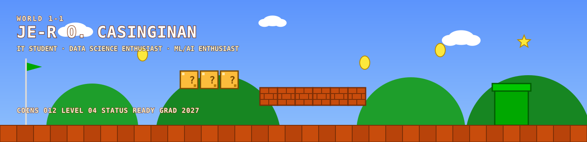

<div align="center">



<br/>

<a href="#world-1-1--about-me"></a>
<a href="#world-1-3--project-lab"></a>
<a href="#finish"></a>

<sub><a href="#world-1-1--about-me">About</a> &middot; <a href="#world-1-2--tech-stack">Stack</a> &middot; <a href="#world-1-3--project-lab">Projects</a> &middot; <a href="#world-1-4--the-journey">Journey</a> &middot; <a href="#boss-level--current-goals">Goals</a> &middot; <a href="#finish">Contact</a></sub>

</div>

<br/>

> **Setup:** five `[ADD_..._REPO_URL]` placeholders in World 1-3 point to your actual repos — swap them in before publishing. Everything else (GitHub, LinkedIn, email, CPIS demo) is already live.

<br/>

## Player Profile

<table>
<tr><td>

```
PLAYER        JE-R O. CASINGINAN
CLASS         BSIT STUDENT (QCU, MANILA) — GRAD. 2027
STATUS        ● BUILDING
FOCUS         AI/ML · COMPUTER VISION · CYBERSECURITY · FULL-STACK
CURRENT QUEST BECOME AN AI ENGINEER
```

</td></tr>
</table>

<br/>

## World 1-1 — About Me

I'm a final-year BSIT student who treats every project like a level to clear — pick a hard problem, prototype fast, break it, understand why it broke, and ship something better. My run so far has taken me through machine learning, computer vision, cybersecurity, and full-stack development, with a capstone and a growing lineup of side projects along the way.

`LEARN → BUILD → BREAK → UNDERSTAND → IMPROVE → REPEAT`


## World 1-2 — Tech Stack

> Every world has its collectibles. Here's the inventory.

<table>
<tr><td valign="top" width="50%">

**🍄 Power-Ups — Languages**


**🔥 Fire Flowers — AI / ML / CV**


**⭐ Star Power — Frameworks**


</td><td valign="top" width="50%">

**🪙 Coin Blocks — Data / Backend**


**❓ Question Blocks — Tools & Infra**


**🧠 Special Ability — Security**

`NIST CSF` `OWASP` `MITRE ATT&CK` — Cisco Introduction to Cybersecurity certified

**🏆 Certifications Unlocked**

DataCamp Data Scientist Associate · DataCamp Associate AI Engineer · Cisco Intro to Cybersecurity

</td></tr>
</table>


## World 1-3 — Project Lab

> Real levels only — every project below is actually built. Status is kept honest.

<table>
<tr><td width="70%" valign="top">

**🏰 LEVEL 1 — QCU SafeGuard** <sub>capstone</sub>

Real-time PPE compliance and fall/immobility detection system built for QCU. YOLOv8 handles detection, a Next.js dashboard shows live status, and WebSocket alerts flag violations the moment they happen.

`Next.js` `FastAPI` `YOLOv8` `WebSocket`

**Status:** `IN DEVELOPMENT — ADVANCED`

[`Source`]([ADD_SAFEGUARD_REPO_URL])

</td><td width="30%" valign="top">

🧱🧱🧱🧱🧱<br/>
🧱❓🧱❓🧱<br/>
🧱🧱🚩🧱🧱

</td></tr>
<tr><td colspan="2"></td></tr>
<tr><td width="70%" valign="top">

**🏰 LEVEL 2 — EPIRMP** <sub>Enterprise Project Intelligence & Risk Management Platform</sub>

A multi-phase FastAPI backend for project risk intelligence: core CRUD API, an ETL pipeline, an ML delay-prediction model explained with SHAP, an MCP server for AI-assistant integration, and Power BI dashboards — now getting a React frontend as its customer-facing dashboard.

`FastAPI` `SQLAlchemy` `JWT` `SHAP` `MCP` `Power BI` `React`

**Status:** `MULTI-PHASE — IN PROGRESS`

[`Source`]([ADD_EPIRMP_REPO_URL])

</td><td width="30%" valign="top">

🧱🧱🧱🧱🧱<br/>
🧱❓🧱❓🧱<br/>
🧱🧱🚩🧱🧱

</td></tr>
<tr><td colspan="2"></td></tr>
<tr><td width="70%" valign="top">

**🏰 LEVEL 3 — CPIS** <sub>Cognitive Performance Intelligence System</sub>

Estimates a cognitive-performance proxy score from sleep, stress, and lifestyle data. Random Forest model, SHAP for explainability, a FastAPI backend, and a Streamlit dashboard shipped to Streamlit Community Cloud.

`Python` `Pandas` `Scikit-learn` `SHAP` `FastAPI` `Streamlit`

**Status:** `COMPLETED — LIVE DEMO`

[`Source`]([ADD_CPIS_REPO_URL]) &nbsp;&middot;&nbsp; [`Play Demo`](https://cpis-cognitive-performance.streamlit.app/)

</td><td width="30%" valign="top">

🧱🧱🧱🧱🧱<br/>
🧱❓🧱❓🧱<br/>
🧱🧱🚩🧱🧱

</td></tr>
<tr><td colspan="2"></td></tr>
<tr><td width="70%" valign="top">

**🏰 LEVEL 4 — PulseSense** <sub>GCash ImaGnation Innovation Challenge</sub>

A decision-support feature for Filipino MSMEs, built for the GCash hackathon. Ships an Intention Ledger, an Utang Shield safety net, and a Negosyo Starter pathway to help small business owners plan with more confidence.

`Product Design` `FinTech` `Decision Support`

**Status:** `HACKATHON — ADVANCED, DOCUMENTED`

[`Source`]([ADD_PULSESENSE_REPO_URL])

</td><td width="30%" valign="top">

🧱🧱🧱🧱🧱<br/>
🧱❓🧱❓🧱<br/>
🧱🧱🚩🧱🧱

</td></tr>
<tr><td colspan="2"></td></tr>
<tr><td width="70%" valign="top">

**🏰 LEVEL 5 — SLTT** <sub>Sign Language to Text</sub>

Desktop app that translates ASL fingerspelling to text in real time. MediaPipe hand tracking feeds a Random Forest classifier trained with mirror augmentation, hitting ~99% held-out validation accuracy on the ASL Alphabet dataset, with spoken output via pyttsx3.

`Python` `MediaPipe` `Scikit-learn` `OpenCV` `pyttsx3`

**Status:** `COMPLETED`

[`Source`]([ADD_SLTT_REPO_URL])

</td><td width="30%" valign="top">

🧱🧱🧱🧱🧱<br/>
🧱❓🧱❓🧱<br/>
🧱🧱🚩🧱🧱

</td></tr>
</table>

<details>
<summary><strong>🌟 Bonus Levels — Side Quests</strong></summary>
<br/>

- **ORACLE** — a cinematic, scroll-driven Vue 3 + TypeScript + Three.js web experience with a GLSL reactor core and a scroll-synced camera fly-through.
- **SENTRIX** — a cybersecurity communication platform, built as a NestJS + Next.js 15 monorepo with PostgreSQL, Redis, Prisma, and Socket.io.
- **ProgressIQ** — a Flutter/Dart study-productivity app for Android, built with Riverpod, Firebase, and MVVM.
- **PoseStudio** — a Next.js 14 photobooth app scaffolded with Supabase auth/RLS and Framer Motion.

</details>

## World 1-4 — The Journey

<div align="center">


</div>

<sub>If the widgets above don't load, the same activity is visible on the <a href="https://github.com/Casinginan">GitHub profile page</a>.</sub>

```
ACTIVE      AI / ML, Computer Vision
BUILDING    EPIRMP React frontend, QCU SafeGuard
DEEPENING   System architecture, cloud (AWS)
EXPLORING   3D web experiences, applied security
```

## Boss Level — Current Goals

```
🏆 BECOME AN AI ENGINEER          [██████████████░░░░░░]  IN PROGRESS
☁️  LEARN AWS                      [██████░░░░░░░░░░░░░░]  IN PROGRESS
🧳 BUILD A STRONG INTERNSHIP PORTFOLIO   [████████████░░░░░░░░]  IN PROGRESS
🎓 GRADUATE — BSIT, QCU, 2027      [████████████████░░░░]  ON TRACK
```


## Finish

<div align="center">

**Got an interesting problem? Let's build something worth understanding.**

<a href="https://github.com/Casinginan"></a>
<a href="https://www.linkedin.com/in/je-r-casinginan-48b238391/"></a>
<a href="mailto:jercasinginan@gmail.com"></a>

<br/><br/>

<sub>🪙 THANKS FOR PLAYING — SCROLL BACK TO <a href="#player-profile">WORLD 1-1</a> ANYTIME</sub>

</div>
